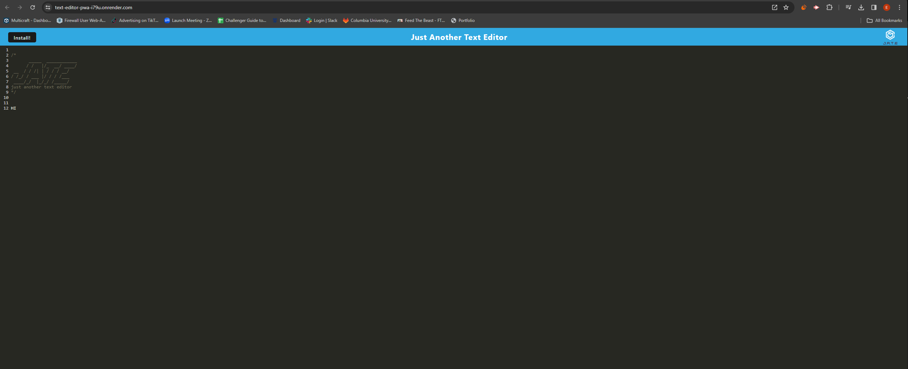

# E-commerce Back End

## Description

This Project was designed to replicate the backend database and routes of an e-commerce website using Object-Relational Mapping (ORM) framework. The routes carry data around and redirects the pages to show all the necessary information to run a e-commerce application. This porject provides endpoints that allow management of categories, products, and orders. 

## Repository
https://github.com/evan17812/E-commerce-Back-End

## Screenshot
